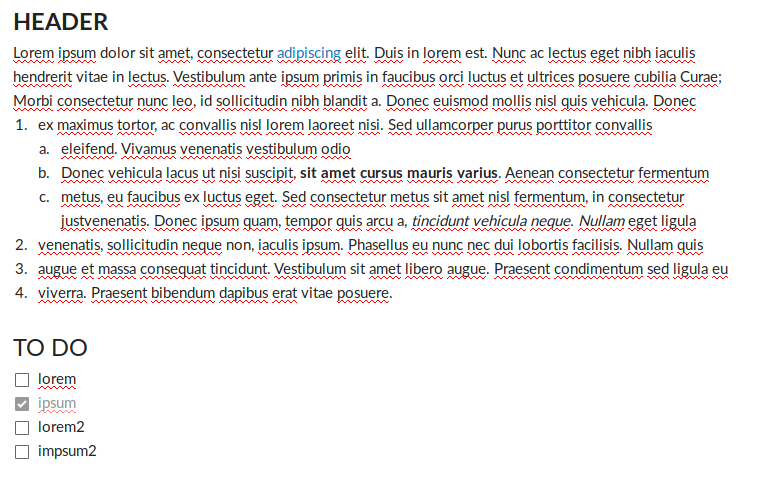
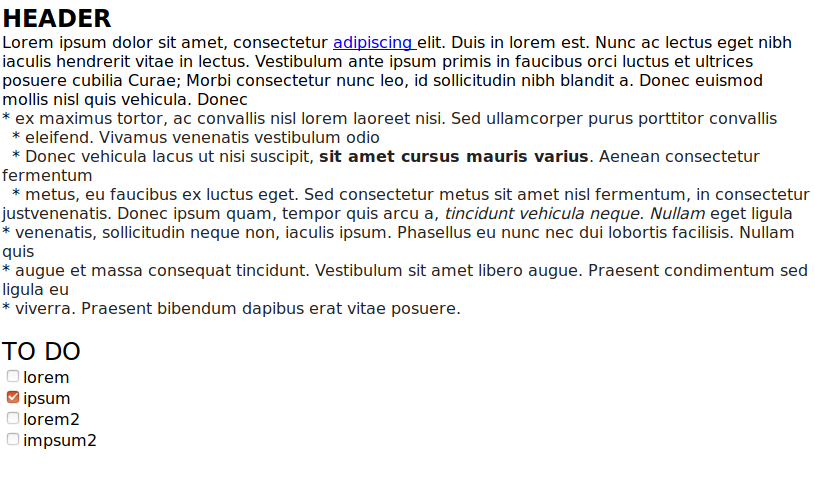

# boxnotes2html

boxnotes2html is a tool to convert Box Notes to html, markdown or plain text



*to*



# Rationale

Box notes are a proprietary format. According to this [support ticket](https://community.box.com/t5/Desktop-and-Mobile-Forum/Exporting-Box-Notes/td-p/14834) the official way in which they meet GDPR compliance is through allowing users to print the notes page as a PDF when it's open in a web browser.  Another option is to Copy/paste the document into LibreOffice, Google Docs, Microsoft Word or some other text-editing program. Neither of these are very attractive options when exporting a large number of Box notes, say, for archival/backup purposes or in the process of migrating to another platform.


# Installation

No external dependencies! Just the good old Python standard library. (plus pytest for tests)

Use `pip install boxnotes2html` to install.

Requires Python 3. Tested on >=3.5

# Usage

`boxnotes2html -h` for help and options.

To convert a file:

`boxnotes2html mynote.boxnote`

Will create a file called mynote. You can optionally specify the filetype with `-f`, current options, in order to most to least reliable, html, md (markdown), and txt (plaintext)

You can specify one or more options. If any of the options are a directory, boxnotes2html will convert those notes and put the new file next to it in the directory path.

Box doesn't allow for you to download individual Box notes from the UI, but you can put them into a folder and download that folder, or use the API.

You can also use boxnotes2html as an imported library:

```python
from boxnotes2html import BoxNote

# from string
note = BoxNote("boxnote_file_content_string")
# Or from file
note = BoxNote.from_file("filename.boxnote")

note.as_html() # returns an html string
note.as_markdown() # returns a markdown string
note.as_text() # returns raw text
```

The HTML formatted by this tool is pretty ugly -- that may not be important for a lot of cases, but you may want to use [tidy](http://www.html-tidy.org/) or another tool to clean it up. You can also use [pandoc](https://pandoc.org/) to convert from html to another format, such as PDFs, markdown, microsoft word, and so on. I haven't tested all these tools, so YMMV.


Functioning:
* Text formatting (bold, underline, colors, size, etc)
* Hyperlinks

Caveats:
* Lists are a little wonky -- they are just stars with spcaes instead of HTML tags. A TBD if there is interest
* Tables are broken and will just be converted to plaintext. If you can figure out a clean way to do this, please submit a pull request.
* Images are just a link to the image in Box, converting them would require API access.
* Comments and annotations are not saved.
* This tool is in ALPHA, bugs may exist. Please report any issues you encounter!

If this tool is unsatisfactory to your needs, please contact Box and tell them to build this much-needed feature!

# Technical summary

Box notes are formatting as a JSON. They include a bunch of text and metadata. Some of this metadata is in a long "attributes" string. This string encoded various styles to different properties, using base36 numbers. This formatting is HTML-like but not exactly HTML. Check out the code for more details. Feel free to contact me on GitHub or email me with any questions on feedback: alex@alexwennerberg.com If you use this library, I would love to know what your experience is, positive or negative.

Thanks, and enjoy!

Alex
